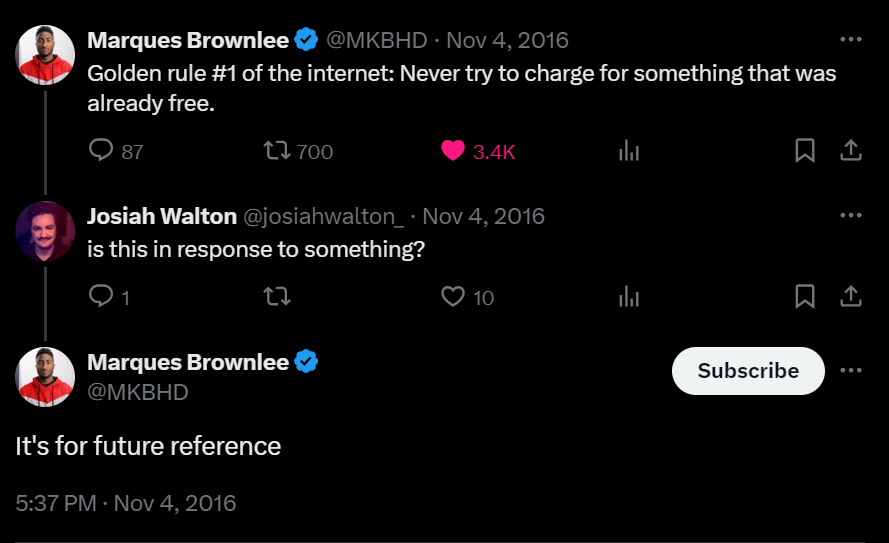

# Shell and Javascript script to download wallpapers from MKBHD's wall app

## How to use

#### Javascript

1. Clone the repository
2. Run `npm install`
3. Run `node index.js`

#### Shell

1. `chmod +x index.sh`
2. `./index.sh`

if you want to download a definate number of wallpapers, you can change the count in line 25 in `index.js` as instrcuted on line 24.

## Why this repo?
The walls are available on a public bucket so its fair use.

also 

